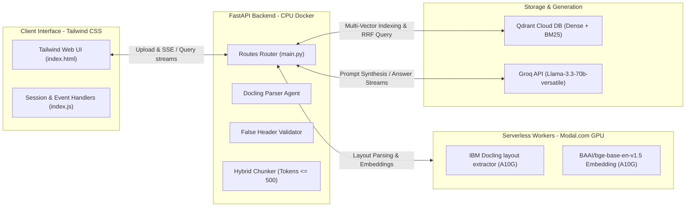

# 🌌 KhojAI — Serverless Split-Cloud Hybrid RAG System

Welcome to the official repository for **KhojAI**, a highly optimized, enterprise-grade Retrieval-Augmented Generation (RAG) system. KhojAI uses a **Split-Cloud Serverless GPU Architecture** to deliver high-fidelity layout-aware PDF document ingestion, hybrid vector/keyword search with Reciprocal Rank Fusion (RRF), and streaming generative answers with inline scholarly citations.

🚀 **Live URL:** [KhojAI Application Portal](https://homeless-stages-mass-stop.trycloudflare.com/) *(First query may take a moment to spin up remote GPU containers).*

---

## 🏗️ Project Architecture Overview

KhojAI splits the high-cost machine learning workload from the lightweight routing and UI workloads to achieve a zero-compute-cost idle state and highly scalable execution:



* **Interactive Frontend:** A sleek, minimal web interface built using Tailwind CSS that manages document uploads, handles real-time Server-Sent Events (SSE) representing ingestion stages, renders a chat assistant layout with inline citation links, and performs session cleaning via beacon requests on tab exit.
* **Lightweight FastAPI Backend:** Orchestrates data flow, implements smart document validation rules, structures text segments, builds dual-vector payloads, and retrieves hybrid contexts.
* **Serverless GPU Workers (Modal):** Deploys remote Python executors scaling up to dozens of high-performance GPUs on-demand to process dense document layout extraction (Docling) and neural representations.

---

## 📂 Repository Layout

```bash
rag_bot/
├── Backend/
│   └── app/                 # FastAPI RAG Backend application code.
│       ├── api/             # API routes (/upload, /query, /session).
│       ├── core/            # Modal deployment configs & Qdrant/LLM initializers.
│       ├── models/          # Request/Response schemas (Pydantic).
│       ├── pipeline/        # RAG pipeline orchestrator.
│       ├── services/        # Logic: document parsing, chunking, retrieval, vectors.
│       ├── utils/           # Helper utilities.
│       ├── Dockerfile       # CPU-only Docker image for local/cloud deploy.
│       ├── evaluation.py    # Ragas evaluation benchmarker.
│       └── requirements.txt # Python dependencies.
├── frontend/
│   ├── index.html           # Tailwind CSS portal view.
│   └── static/
│       └── jss/
│           └── index.js     # Handles uploads, SSE events, and streaming answers.
├── docker-compose.yml       # Legacy Weaviate local configuration.
└── README.md                # This root workspace documentation.
```

---

## 🌟 Key Technology Highlights

1. **Split-Cloud GPU/CPU Processing:** Eliminates the need for local GPU setup. Local Docker image runs purely on CPU (under 1.5 GB), offloading AI calculations to remote high-capacity serverless GPUs.
2. **Layout-Aware Ingestion (IBM Docling):** Parses multi-modal components (paragraphs, headers, lists, boundaries) and converts tabular components into Markdown representations for higher-accuracy embedding indexing.
3. **Repeated Header/Footer Eliminator:** Strips running headers, page markers, and document noise, and re-parents orphan paragraphs to prior sections to ensure context integrity.
4. **Qdrant Multi-Vector Hybrid Indexing:** Builds dense semantic representations (768-dim BGE embeddings) alongside BM25 sparse keyword representations on chunk headings within Qdrant Cloud.
5. **Reciprocal Rank Fusion (RRF):** Fuses dense vector scores (weight: 1.5) with sparse text scores (weight: 1.0) to retrieve the top 5 highly relevant chunks.
6. **Token-by-Token Streaming with Inline Scholarly Citations:** Synthesizes final answers using `llama-3.3-70b-versatile` on Groq, embedding inline page citations (e.g. `[p. X]`) representing source content.
7. **Ragas Benchmarking Suite:** Built-in Ragas evaluation verifying **Faithfulness**, **Answer Relevancy**, **Context Recall**, and **Context Precision** using `meta-llama/llama-4-scout-17b-16e-instruct` on Groq.

---

## 🛠️ Setup & Execution Guide

Refer to specific sub-folder documentations for detailed build/setup commands:

### Backend Configuration
1. Change directory to backend:
   ```bash
   cd Backend/app
   ```
2. Create your `.env` configuration:
   ```env
   GROQ_API_KEY=your_groq_api_key
   QDRANT_API_KEY=your_qdrant_cloud_api_key
   ```
3. Initialize and deploy Modal remote workers:
   ```bash
   python -m modal setup
   modal deploy core/modals.py
   ```
4. Start FastAPI server locally or run in Docker. Detailed commands are outlined in [Backend README.md](file:///c:/Users/hp/OneDrive/Desktop/rag_bot/Backend/app/README.md).

### Frontend Execution
* The frontend is a static web application (`frontend/index.html`).
* Update the base URLs in `frontend/static/jss/index.js` to point to your backend API tunnel address or local server (`http://127.0.0.1:8000`).
* Open `frontend/index.html` directly in your browser or serve it using any lightweight static web server.
* To clear sessions automatically when users leave the portal, the frontend fires a beacon request to the backend `/session/{session_id}` endpoint.
